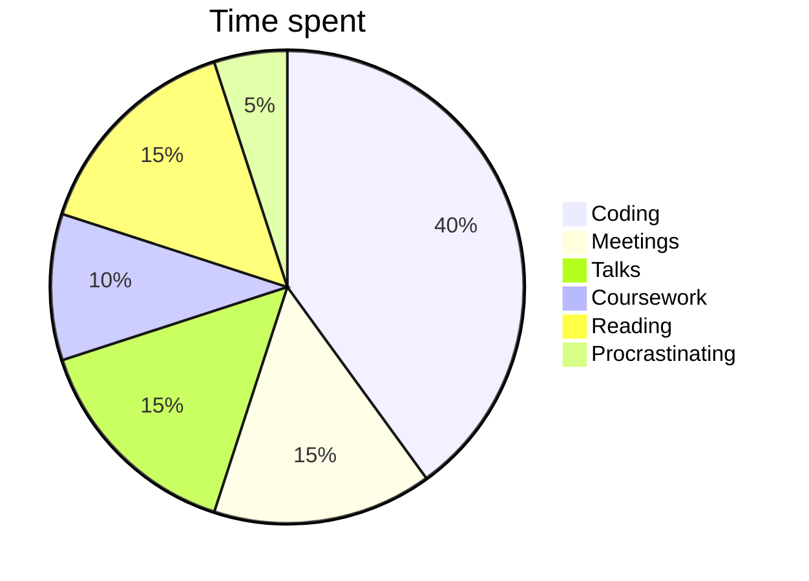

> [!Warning] Disclaimers
>  - This is my first blog post  
> -  This is simply for my own enjoyment, take from it what you please.

Research shows that the most common questions in early social interactions are those that aim to identify shared context, typically in the form of identity-establishing questions like

>[!question] What do you do?  

Usually when I tell people I study physics, the typical response is a puzzled look of confusion, or something like "that sounds difficult." It is natural to be confused, since physics represents a relatively small portion of college majors and fields of work. To many, physics is a mysterious, esoteric field that has seemingly little connection with their lives. To others, they may read about it on occasion, catch bits and pieces of information in the media, or may have even taken a class at some point, learning Newton's laws of motion and how to apply them. Most, however, have little notions of what physics is about. But at some point or another, we have all wondered about the world around us. Be it as a child learning how to operate our bodies in the physical world, or as an adult looking at the stars in the night sky, wondering what lies beyond. This is what physics is all about -- understanding the universe around us. 

A follow up question is usually something like

> [!question] What do you plan to do with that?

My typical response is along the line of, "I'd like to do research." Again, a puzzled look appears. When someone asks this question, what they really mean is "what kind of career do you want to have?" "Research," is not a career in the traditional sense. Often times, they are not really sure what it _means_ to do research. However, I deliberately dodge declaring a specific career path, because as with most PhD students, I simply don't know what career I will have. During your PhD, you are absorbed in your field of interest, and the work is largely academic. If you want to continue this kind of work, you would likely continue into academia, becoming faculty at a university. The positions are relatively sparse, and so a large percentage of us will wind up in the vast world of _industry_. What this means is widely varying and depends on your field of study and what skills you've acquired. Typically for scientific domains, this will involve some sort of data analysis or R&D position. I personally try to give little thought to where I'll end up. I enjoy doing research, and I'd like to continue as long as I can, wherever that may be.

The experience I've just described is a common and recurring one. So, what I aim to do in this post is share a bit about what I do. If you've stumbled upon this post as a non-physicist hopefully you will find it interesting, or if you are a physicist, maybe you can still enjoy my musings.

> [!question]  What is condensed matter physics?

I am not going to attempt to provide an overview of the field of physics as a whole, or for that matter, condensed matter physics. Condensed matter physics is the largest subfield of physics, and is a wide spanning landscape of different research topics. I would instead like to give a little picture of what it means to "do" condensed matter physics, and perhaps a flavor of what it aims to achieve.

The Wikipedia definition of condensed matter physics is:

> [!quote] Condensed matter physics is the field of physics that deals with macroscopic and microscopic physical properties of matter, especially in the solid and liquid phases, that arise from electromagnetic forces between atoms and electrons.

While this technically is an all-encompassing definition, it really doesn't give a feeling for what it means to study condensed matter physics. 

> [!info] Aside
> The phrase "condensed matter physics" was not coined until the late 1960s by Nobel Laureate Phillip Anderson. In fact, the story of condensed matter physics has a much longer history, deeply tied with the history of humanity. To see a summary of this history, take a look at my second blog post [[A Brief History of Materials]].

> [!question] Why do we study "condensed matter" at all? 

For one, it represents the overwhelming majority of the world around us. Metals, wood, silicon, organic material, are all forms of "condensed matter" and play vastly varying and important roles in our lives. All of the examples I just listed are solids, but the study of condensed matter extends to gases and liquids as well. This does not encompass all of the phases of matter, for example plasma, like that in the sun, is yet another state of matter. More modern research has revealed additional states of matter -- superfluidity, Bose-Einstein condensates, fermionic condensates, and still more being discovered -- which often fall in the domain of, or at least overlap with, condensed matter physics. These more exotic phases are typically found in a lab or within stars. Most of the matter we interact with, however, is in the solid state, and this is the subject of the majority of condensed matter research.

On a practical level, the study of solids has been a successful enterprise that has lead to most of the technological advancements we have today. The building blocks of computers and modern electronics, the transistor, was invented at Bell Labs in Murray Hill, New Jersey through our understanding of the solid state. The development of the MRI machine required an understanding of the magnetic behavior of nuclei in materials and currently relies on a large number of semiconducting transistors to operate. Developments like lasers, solar cells, positron-emission tomography, televisions, radios (the list goes on) have revolutionized nearly every area of life and all started in a physics lab somewhere. 

However, in my view, the most fascinating and important reason to study condensed matter physics is that it tells us about the universe. Materials provide an accessible laboratory on Earth for us to explore the underlying laws governing the universe as a whole. Ourselves, and the matter around us, are not exempt from these laws. The questions about the very nature of reality can be sequestered in the behaviors of rather mundane materials, and within us. The attitude of many physicists, and myself for the most part, is that we don't really care what practical uses our research has in the "real world." Of course, if your research happens to lead to a new revolutionary technology that makes the world a better place, all the better. But the reality is, most of the research we do only has implications within our narrow fields of interest. We will all argue, of course, that our research is in fact not so narrow, and represents an important facet of reality. If we're lucky, it will influence a number of other research projects, which influences others, and so on, which will hopefully accumulate to a better understanding of the world. The main driving force for myself, however, is personal enlightenment and the art of doing science. Science is a beautiful symphony of minds coming together to create something where there wasn't before. This "something," however seemingly tiny it is, in the end reflects a truth about the nature of reality. The very fact that it exists, and that we are able to find it, is one of the deepest mysteries of all.

> [!question] Yes, but what do you __do__?

Okay so after my rant about what condensed matter physics is and why its important, that still doesn't explain what a condensed matter physicist __does__. The answer depends on who you ask.

If you approach an experimental condensed matter physicist and ask, what do you do? They may answer by telling you there is some material of interest that has potential for real-world applications or may reveal something interesting about physics. This must be something physical and tangible, since experiment is in the business of measuring. They may then tell you that they begin by growing or manufacturing a material they are interested in investigating, they prepare the relevant conditions for observing something about the material, and make the appropriate measurements to reveal a property of the material. They then interpret their results with established or suggested theories, and propose potential uses for their experimental devices.

If you ask a theorist, like myself, we would say that we first begin by establishing a model for a system of interest. This system may be a real material, or a simplified picture of a material that captures the essence of its characteristics. This model could be based on well-established theories, or if one doesn't exist, we try to invent one. These models are typically in the form of equations, and the methods of solving these equations are by hand or through the use of computer code written to solve these equations. The solutions come in the form of numerical data or functions that can be seen in a graph comparing the numbers. We compare these plots with experimental measurements to verify that our theory actually explains something real about the world. This is the cycle of research; experiments motivating theories motivating experiments and so on. 

There are of course exceptions to this picture. In more mathematical subfields of physics, experimental connection is not always made. Whether this has "real world" implications depends on if you believe that science will always find its way into society, or if mathematics lives in a real and independent world of its own, but that is a topic for another post.

In practice, on an average day, about 40 percent of my time is spent writing computer code. This means I write instructions for the computer to do something, solve some equations, do something with the results. The end result is nice looking plots to appear in a paper summarizing the findings. Within that 40 percent, I am testing and running the code, debugging the inevitable errors in the code, rewriting the code to be more efficient, writing documentation for future developers and readers of the code, and maintaining it with version control, uploading to GitHub and so forth. The remaining 65 percent of my time is spent meeting and discussing the results with my advisor, preparing and giving talks at group meetings and conferences, reading papers on the subject, coursework, and, as we all do, procrastinating. 

So, this is the broad picture. Hopefully if you've read this far you've learned something interesting. If you've found your way here as a fellow physicist, don't judge me too harshly if your views don't align. If for some reason you're here as a non-physicist, maybe you've learned something interesting about the world of doing physics.