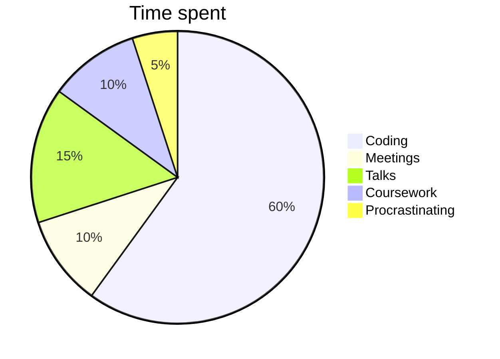

> [!Warning] Disclaimers
>  - This is my first blog post  
> -  This is simply for my own enjoyment, take from it what you please.

Research shows that the most common questions in early social interactions are those that aim to identify shared context, typically in the form of identity-establishing questions like

>[!question] What do you do?  

Usually when I am met with this type of question, I answer with some permutation of, "I study physics." A typical response is a puzzled look of confusion, or something like "that sounds difficult." Immediately, any hope of shared context is lost. 

To many, physics is just a mysterious, esoteric field that has seemingly little connection with their lives. To others, they may read about it on occasion, catch bits and pieces of information in the media. To some, they may have taken a class at some point, learning Newton's laws of motion and how to apply them. Most have little notions of what physics is about, not to mention the implications it has. But at some point or another, we have all wondered about the world around us. Be it as a child learning how to operate our bodies in the physical world, or as an adult looking up at the stars in the night sky, pondering what lies beyond. From my perspective this is what physics is all about; understanding this "place" we exist in. 

So, what I aim to do in this post is share a bit about what I do. If you've stumbled upon this post as a non-physicist hopefully you will find it interesting, or if you are a physicist, maybe you can still enjoy my musings.

> [!question]  What is condensed matter physics?

I am not going to attempt to provide an overview of the field of physics as a whole. That is an undertaking for another day. I would like to approach the more modest task of explaining its largest subfield, condensed matter physics. 

The Wikipedia definition of condensed matter physics is:

> [!quote] Condensed matter physics is the field of physics that deals with macroscopic and microscopic physical properties of matter, especially in the solid and liquid phases, that arise from electromagnetic forces between atoms and electrons.

While this technically is an all-encompassing definition, it really doesn't give a feeling for what it means to study condensed matter physics. In fact, the phrase "condensed matter physics" was not coined until the late 1960s by Nobel Laureate Phillip Anderson. The story of condensed matter physics has a much longer history, deeply tied with the history of humanity. To see my summary of this history, take a look at my post [[A Brief History of Materials]].

> [!question] Why do we study "condensed matter" at all? 

For one, it represents the overwhelming majority of the world around us. Metals, glass, water, wood, silicon, organic material, are all forms of "condensed matter" and play vastly varying and important roles in our lives. All of the examples I just listed are solids, but the study of condensed matter extends to gases and liquids as well. This does not encompass all of the phases of matter, for example plasma, like that in the sun, is yet another state of matter. More modern research has revealed additional states of matter like superfluidity, Bose-Einstein condensates, fermionic condensates, and still more being discovered, which often fall in the domain of, or at least overlap with, condensed matter physics. These more exotic phases are typically found in a lab or within stars. Most of the matter we interact with, however, is in the solid state, and this is the subject of the majority of condensed matter research.

On a practical level, the study of solids has been a successful enterprise that has lead to most of the technological advancements we have today. The building blocks of computers and modern electronics, the transistor, was invented at Bell Labs in Murray Hill, New Jersey through our understanding of the solid state. The development of the MRI machine required an understanding of the magnetic behavior of nuclei in materials and currently relies on a large number of semiconducting transistors to operate. Developments like lasers, solar cells, positron-emission tomography, televisions, radios (the list goes on) have revolutionized nearly every area of life and all started in a physics lab somewhere. 

However, in my view, the most fascinating and important reason to study condensed matter physics is that it tells us about the universe. Materials provide an accessible laboratory on Earth for us to explore the underlying laws governing the universe as a whole. Ourselves, and the matter around us, are not exempt from the universe. The questions about the very nature of reality can be sequestered in the behaviors of rather mundane materials, and within us. The attitude of many physicists, and myself for the most part, is that we don't really care what practical uses our research has in the "real world." Of course, if your research happens to lead to revolutionary technology that makes the world a better place, all the better. But the reality is, most of the research we do only has implications within our narrow field of interests. We will all argue, of course, that our research is in fact not so narrow, and represents an important facet of reality. If we're lucky, it will influence a number of other research projects, which influences others, and so on, which will hopefully accumulate to a better understanding of the world. The main driving force for myself, however, is personal enlightenment and the art of doing science. Science is a beautiful symphony of minds coming together to create something where there wasn't before. This "something," however seemingly tiny it is, in the end reflects a truth about the nature of reality. The very fact that it exists, and that we are able to find it, is one of the deepest mysteries of all.

> [!question] Yes, but what do you __do__?

Okay so after my rant about what condensed matter physics is and why its important, that still doesn't explain what a condensed matter physicist __does__. 

Typically, there is some material of interest that has potential for real-world applications, or is of interest for explaining something fundamental about physics. The methods of exploring this material depends on who you ask.

If you approach an experimental condensed matter physicist and ask, what do you do? They may answer by telling you they begin by growing or manufacturing a material they are interested in investigating, they will then prepare the relevant conditions for observing something about the material, and make the appropriate measurements to reveal a property of the material. They will then interpret their results with established or proposed theories, and propose potential applications for their experimental devices if relevant.

If you ask a theorist, like myself, we would say that we first begin by establishing a model of the system or material of interest. This model could be based on well-established theories, or if one doesn't exist, we invent it. These "models" are typically in the form of equations, and the methods of solving these equations are by hand or through the use of computer code written to solve these equations. The solutions come in the form of numerical data or functions that have some characteristics that can be seen through a plot. We compare these plots with experimental measurements to verify that our theory actually explains something about the real world. 

This is the cycle of research; experiments motivating theories motivating experiments and so on. 

In practice, on average, about 60 percent of the time I am writing computer code. This means I write instructions for the computer to do something, solve some equation, do something with the results. The end goal is to generate nice looking plots to go in a paper for publishing. Within that 60 percent, I am debugging inevitable errors that occur, rewriting the code to be more efficient, documenting the code for future developers and readers of the code, and maintaining it with version control, uploading it to GitHub and so forth. The remaining 40 percent of my time is spent meeting and discussing with my advisor, preparing and giving talks at group meetings and conferences, reading previous papers on the subject, and coursework. 

