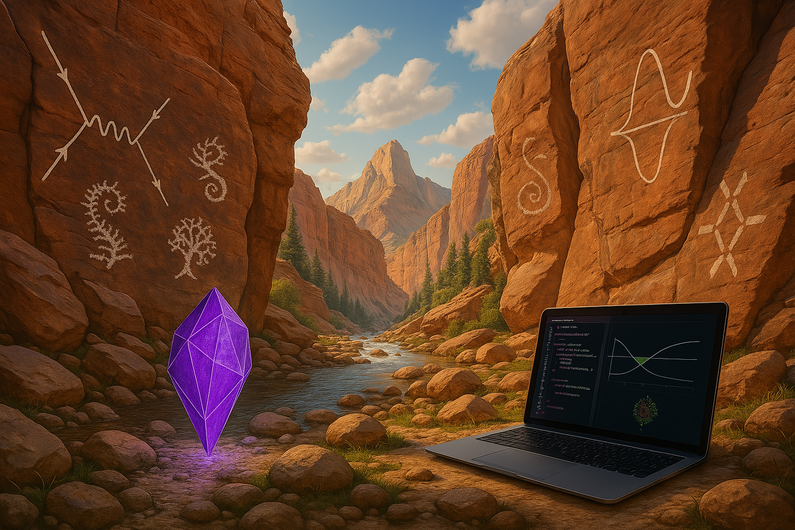
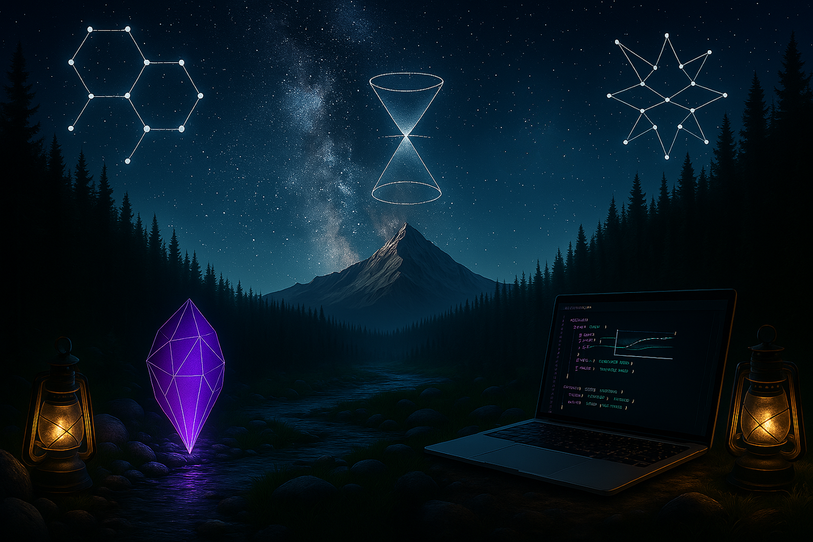

  
  

A __Digital Garden__ is not a blog site, it is a collection of evolving ideas, exploratory writing, and is more unrefined than a traditional blog. 

I sometimes #Blog about things on my mind, or other miscellaneous topics. I may eventually post updates about my #Travel, although nothing exists there yet. I often keep notes about #Physics, #Math, and #Coding for later reference. The "knowledge network" shows a connectivity map of my notes. Click the upper-right button to expand the graph to show the connections between all of my notes. Feel free to look around!

> [!warning] Disclaimer
> - Many of these notes are incomplete and a work in progress. They are from my personal note collection and may not be refined.
> - Some of these notes are from textbooks or sources I have not cited. I will try to add citations as I go.
